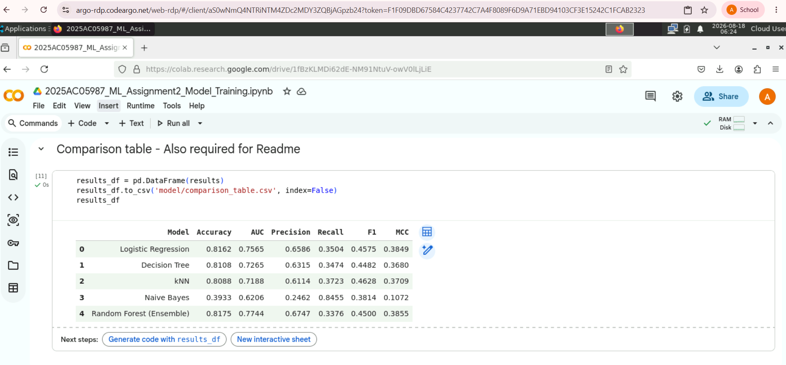
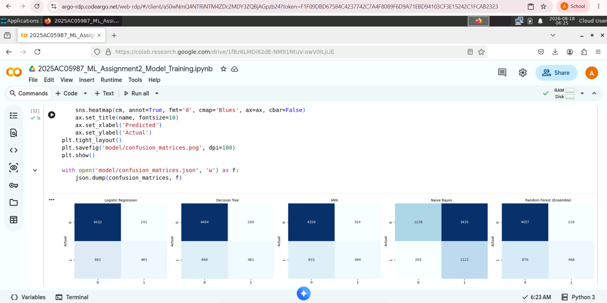

# Credit Card Default Prediction — ML Assignment 2

## a. Problem Statement

Credit card companies need to anticipate which customers are likely to default on
their payment in the following month, so they can manage risk and intervene early
(adjusted credit limits, payment reminders, etc.). This project frames that as a
**binary classification problem**: given a customer's credit profile, demographics,
and six months of billing/payment history, predict whether they will default on
their credit card payment next month (`1` = default, `0` = no default).

## b. Dataset Description

**Source:** [Default of Credit Card Clients Dataset](https://archive.ics.uci.edu/dataset/350/default+of+credit+card+clients) (UCI Machine Learning Repository)

- **Instances:** 30,000
- **Features:** 23
  - Demographic: `sex`, `education`, `marriage`, `age`
  - Credit: `limit_bal` (credit limit)
  - Payment history (6 months, Apr–Sep): `payment_status_apr` ... `payment_status_sep`
  - Bill statements (6 months): `bill_statement_apr` ... `bill_statement_sep`
  - Previous payments (6 months): `previous_payment_apr` ... `previous_payment_sep`
- **Target:** `default_payment_next_month` (binary: 0 = no default, 1 = default)
- **Class balance:** 23,364 no-default (77.9%) vs 6,636 default (22.1%) — moderately imbalanced
- **Preprocessing applied:**
  - Missing values (~150 rows in `sex`, `education`, `marriage`, `age`) imputed —
    median for numeric, most-frequent for categorical
  - Categorical columns one-hot encoded (72 total features after encoding)
  - 80/20 stratified train/test split
  - Features standardized (`StandardScaler`) for Logistic Regression and kNN

## c. GitHub Repository Link

<!-- Replace with your actual repo URL after you push -->
`https://github.com/2025ac05987-tech/ML_Assignment_II`

## d. Models Used

All 5 models were trained on the same preprocessed dataset (80/20 stratified split, `random_state=42`).

### Comparison Table

| ML Model Name | Accuracy | AUC | Precision | Recall | F1 | MCC |
|---|---|---|---|---|---|---|
| Logistic Regression | 0.8173 | 0.7506 | 0.6638 | 0.3527 | 0.4606 | 0.3892 |
| Decision Tree | 0.8135 | 0.7413 | 0.6436 | 0.3512 | 0.4544 | 0.3771 |
| kNN | 0.8083 | 0.7146 | 0.6062 | 0.3806 | 0.4676 | 0.3725 |
| Naive Bayes | 0.3942 | 0.6220 | 0.2464 | 0.8448 | 0.3815 | 0.1076 |
| Random Forest (Ensemble) | 0.8158 | 0.7730 | 0.6692 | 0.3308 | 0.4428 | 0.3782 |

### Observations

| ML Model Name | Observation about model performance |
|---|---|
| Logistic Regression | Strong, well-balanced baseline. Highest precision-recall balance among the linear/simple models, and the best MCC after Random Forest — suggests the decision boundary is close to linear in the standardized feature space. |
| Decision Tree | Performs almost identically to Logistic Regression on accuracy but slightly behind on AUC, indicating it captures similar signal without needing scaled inputs. At `max_depth=8` it avoids overfitting while staying interpretable. |
| kNN | Comparable accuracy to the other top models, with the best F1 score of the non-ensemble models. More sensitive to the curse of dimensionality (72 features after encoding), which likely caps its AUC below Logistic Regression and Random Forest. |
| Naive Bayes | Clear underperformer (39% accuracy vs ~81% for others). Its independence assumption breaks down here because payment/bill amounts across six consecutive months are highly correlated, not independent. Notably it has by far the **highest recall (0.84)** — it aggressively flags customers as likely defaulters, trading precision for recall. |
| Random Forest (Ensemble) | **Best AUC (0.773)** of all 5 models, reflecting its strength at capturing non-linear interactions between payment history features. Accuracy is comparable to Logistic Regression, but the higher AUC means it ranks risky customers more reliably — useful if the bank wants to rank customers by risk rather than just classify them. |
| **Overall Winner for this dataset** | **Random Forest (Ensemble)** — best AUC and second-best MCC, with accuracy competitive with the top linear model. For a real deployment where ranking customers by default risk matters (e.g. setting credit limits), AUC is arguably the most important metric, which favors Random Forest. If interpretability were the priority instead, Logistic Regression would be the practical choice given its near-identical performance with a simpler, more explainable model. |

**Note on class imbalance:** With ~78% of customers not defaulting, a model that
always predicts "no default" would score ~78% accuracy while being useless. All
five models beat that trivial baseline on accuracy (except Naive Bayes), but the
gap between accuracy and metrics like Recall/MCC above shows why looking at
multiple metrics — not just accuracy — matters for this kind of imbalanced problem.

---

## Live App

`https://mlassignmentii-nagz6bvo59lu9euu2qzpkm.streamlit.app/`

## BITS Virtual Lab Screenshot

